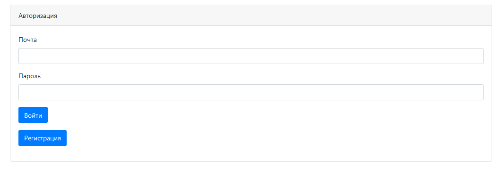
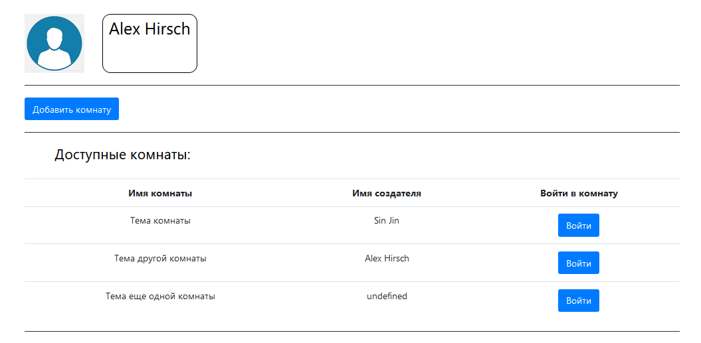
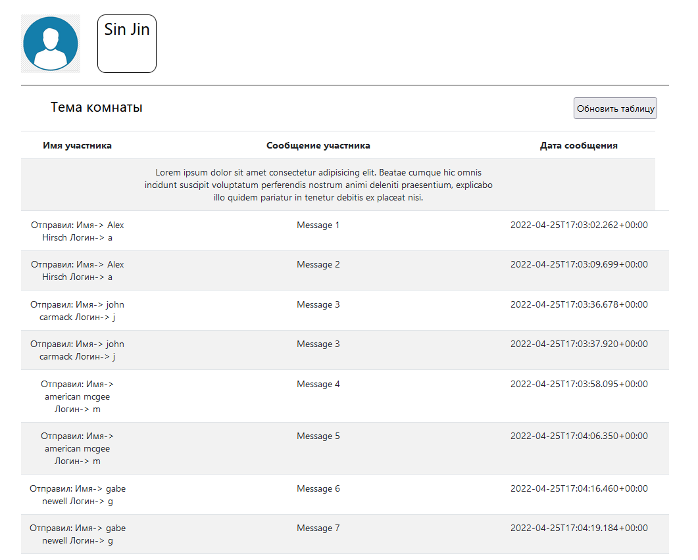
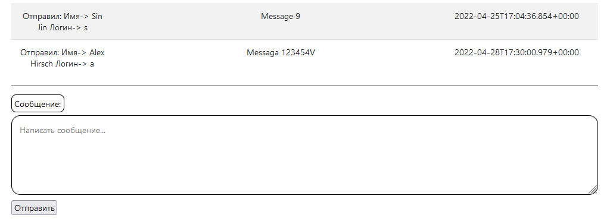
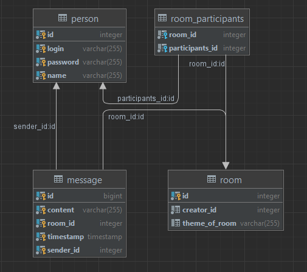

Проект "Чат с комнатами".
Этот проект создавался для отработки знаний, связанных с Rest API, JWT, Ajax.
Технология Ajax постепенно отходят на задний план, но я посчитал нужным отработать ее в этом проекте.
Так же в этом проекте реализованна авторизация/аутоинтификация с помощью jwt токена. 
Проект является экспериментом. 
 Верстать странички помогал Олег Крымов, начинающий front-end разработчик. Позже укажу его github страницу.
Так что работу над проектом можно считать командной.

http://localhost:8082/login.html

Есть стандартная форма авторизации/регистрации:

Мы отправляем логин/пароль, которые проверяются на сервере и, если такой пользователь существует, мы отправляем на фронт jwt токен.

Переходим на страницу с комнатами:

Здесь мы видим список созданных комнат, их Темы/Названия и авторов.

Также есть возможность создать свою комнату, которая будет реализованна позже.

Переходим в комнату:

Здесть Ajax`ом подгружаем сообщения из БД. Видим, кто отправил сообщение, его содержимое и дату отправки.
Внизу страници есть поле для отправки своего сообщения. 

В проекте использовались Spring Boot, Hibernate, JWT, JS, Jquary, Ajax, PostgreSQL

